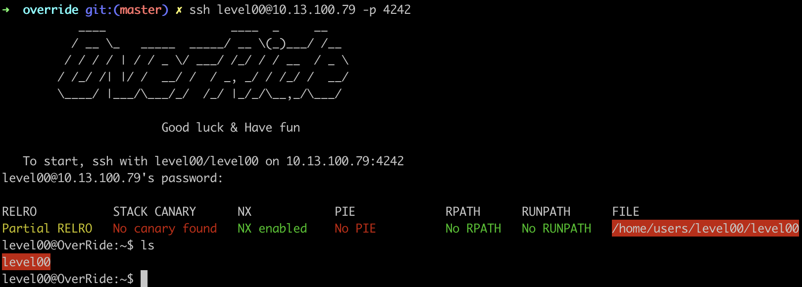

Override is the last project on the binary exploitation branch. An ISO that will have you search for faults present in the protected binaries, and re-build these binaries depending on their behavior.

This project is made in a way that you have to solve every level before getting the access to the next.

[Link for the override ISO](https://cdn.intra.42.fr/isos/OverRide.iso)

Credentials for the first level:

**level00:level00**